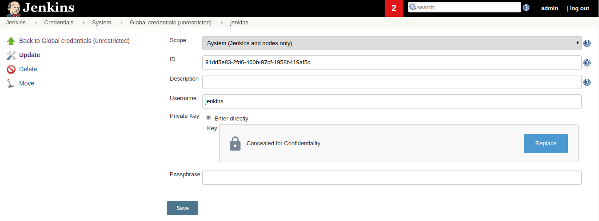
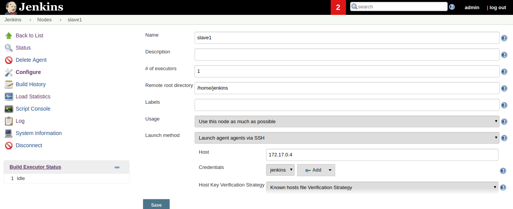

# setup jenkins master-slave by docker 
### install jenkins master 
docker pull jenkins  
docker run -d -p 49001:8080 -v $PWD:/var/jenkins_home --name jenkins-master jenkins:latest  
docker exec -it jenkins-master
generate public key
ssh-keygen -t rsa  -C "Jenkins key"
### install jenkins slave
docker pull jenkins/ssh-slave
docker run --rm  -d -P --name jenkins-slave1 jenkins/ssh-slave:latest "public key"
### create node 
host: slave ip  
private key: master's private key

